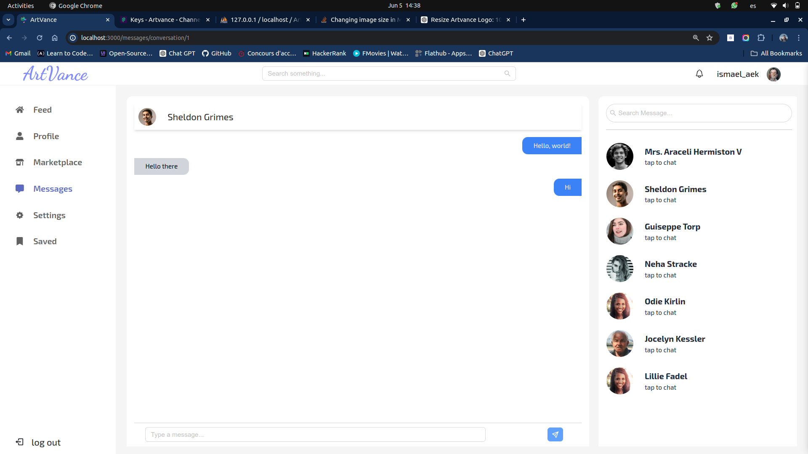

# ArtVnace


Hello everybody!

ArtVance is a vibrant social network designed for artists to showcase their artworks, engage with fellow artists, and participate in a dynamic marketplace. On ArtVance, users can follow each other, share their creative pieces, react to others' posts through likes, comments, saves, and reposts, and engage in direct conversations with other users. Additionally, ArtVance offers a marketplace where artists can sell their artworks, providing a comprehensive platform for creative expression and commerce.

Developed by [Ismael Ait El Kamel](https://github.com/ismaelaek) and [Hiba Aassab](https://github.com/Hiba-Aassab), ArtVance aims to foster a supportive and interactive community for artists of all levels.

### First step 
Using the command below, clone this project to your local machine :

```
git clone https://github.com/ismaelaek/ArtVance.git
```

### Second step

Navigate to the cloned folder.
```
cd ArtVance
```

### 3rd step: installing Laravel dependencies
Navigate to the **Backend** Folder 
```
cd Backend
```

Use those commands to install Laravel dependencies:
```
composer update 
composer install
```
Make sure that a folder named `vendor` appears after the installation!

### 4th step: setting up the environment
Copy the `.env.example` file to `.env` using the command below:
```
cp .env.example .env
```
Make sure to create a DataBase in PhpMyAdmin named **Artvance** and set it in the env file
##### run migration and seed some data

```
php artisan migrate 
php arisan db:seed
```

### 5th step: installing react dependencies
Navigate to the **frontend** folder using 
```
cd ../frontend
```
Then use this command to install all React dependencies 
```
npm install
```
A new folder called `node_modules` will appear in your current directory (frontend).

### Final step: running the application

Firstly open two terminals, one for Laravel and the other for React

##### Laravel Terminal
Navigate to the folder named **backend**
```
cd backend
```
Start the server using 
```
php artisan serve
```

##### React Terminal
Navigate to the folder named **frontend**
```
cd frontend
```
Start the server using 
```
npm run dev
```
### Interfaces 
#### Login

#### Home (feed)

#### Post and comments

#### Profile

#### Marketplace

#### Chat
